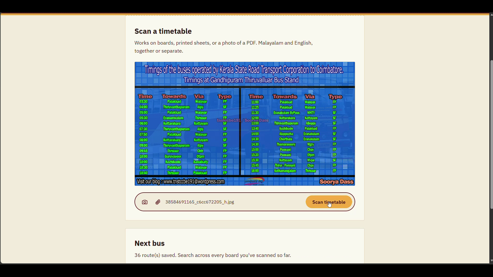
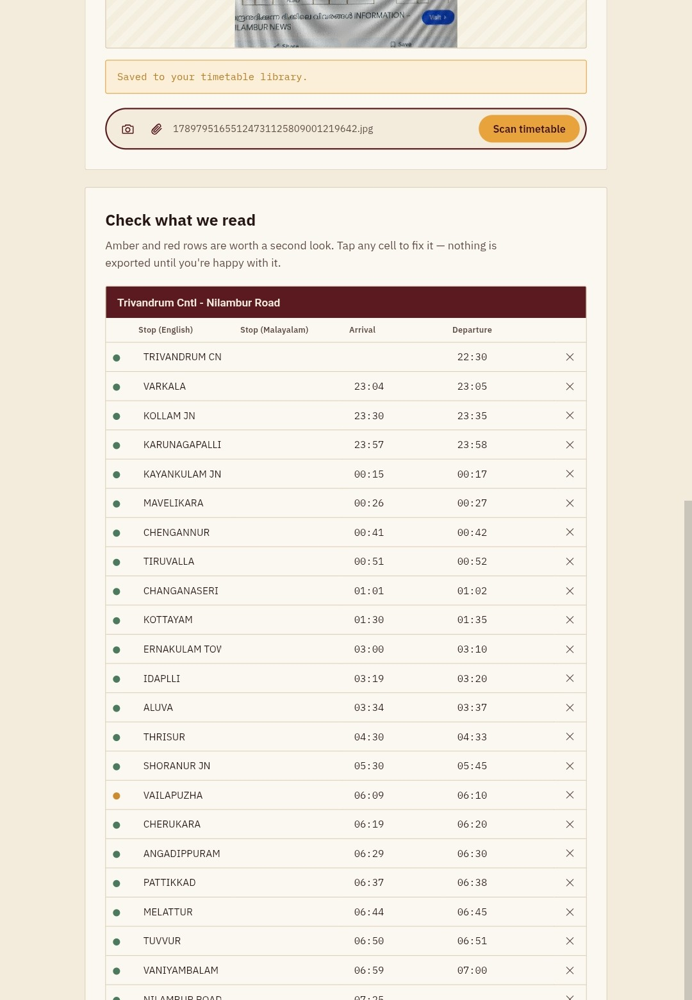
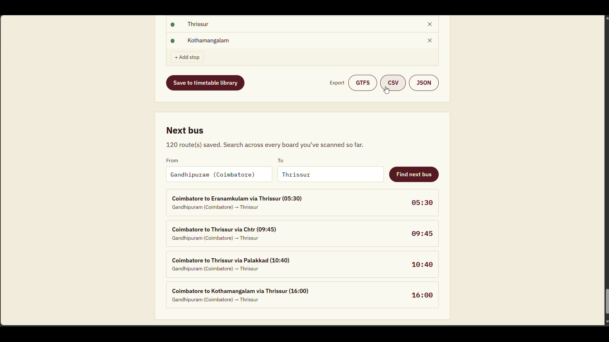

# RouteLens

**[Live demo → routelens-nine.vercel.app](https://routelens-nine.vercel.app)**

Point a camera at any bus timetable — a painted board, a printed sheet, a photo of a PDF — and get back structured, correctable data instead of another photo nobody can search. Built for **ANAVANDI 2026, selection challenge SC-04**.

Most bus schedules in Kerala (private operators, district depots, KSRTC boards) exist only as images: photographed, printed, shared on WhatsApp. None of that reaches Google Maps or any trip planner, because none of it is structured data. RouteLens turns the photo into the data, lets a human fix anything the model got wrong, and exports it in the format transit tools already expect.

## Screenshots

Scanning a real board — glare, skew, and mixed Malayalam/English text included, not a clean test image:



The extracted route, editable stop-by-stop, confidence-coded so you know what to double check (green = trusted, amber = worth a look):



Searching "next bus" across every board scanned so far — no server database, just a filter over what's already been corrected:



## Demo video

_[https://youtu.be/Sw58bclfTbQ?si=gEGVf82afRZvT3NS]_

## What's here

- `index.html`, `style.css`, `app.js` — the whole frontend. No build step, no framework, no `npm install` needed on the browser side.
- `api/extract.js` — a single Vercel serverless function. This is the only place the Gemini API key lives. It calls `gemini-3.6-flash` with the uploaded image (or PDF) and a prompt that forces strict JSON output with a confidence label per stop, and retries automatically on a transient server-side overload before giving up.
- Nothing else calls Gemini. "Next bus" search is a plain filter over data already extracted and corrected — no live scraping, no second AI call, so it can never hallucinate a bus time.

## How it works

1. **Capture** — snap a photo or upload a file (image or PDF). Images are downscaled client-side before upload so large camera photos never hit a server payload limit.
2. **Extract** — the photo goes to Gemini with a prompt that returns strict JSON: every route, every stop, arrival/departure times, and an honest confidence rating per field.
3. **Verify** — low-confidence fields are color-coded. Tap any cell to correct it; a correction is automatically marked high-confidence.
4. **Save** — the corrected route is added to a running library, stored in the browser.
5. **Export or search** — pull GTFS, CSV, or JSON out of the whole library, or query "next bus" between any two stops you've ever scanned.

## Tech stack

| Layer | What it is |
|---|---|
| Frontend | Vanilla HTML/CSS/JS, no framework or bundler |
| Backend | One Vercel serverless function (Node.js, ESM) |
| AI model | Google Gemini 3.6 Flash via the `@google/genai` SDK — multimodal, reads mixed-language images and PDFs directly |
| Storage | Browser `localStorage` — no server-side database |
| Export | GTFS / CSV / JSON generated client-side, zipped with JSZip |
| Hosting | Vercel, connected to GitHub for auto-deploy on push |

## Run it locally

```bash
npm install
cp .env.example .env.local
# edit .env.local and paste your real Gemini API key in place of the placeholder
npx vercel dev
```

`vercel dev` serves both the static frontend and the `/api/extract` function together, exactly like production. Open the URL it prints.

## Deploy to Vercel

```bash
npx vercel --prod
```

The first run walks you through linking or creating a project. Before your first real deploy (or right after), go to your project in the Vercel dashboard → **Settings → Environment Variables** → add:

```
GEMINI_API_KEY = your_real_key
```

Redeploy after adding it if you deployed before setting it. Never commit the key — `.env.local` is already in `.gitignore`.

If you connect the repo to Vercel via GitHub instead (**Project Settings → Git**), every `git push` to `main` redeploys automatically and you can skip the CLI entirely after initial setup.

## Recording the demo video

A tight, unedited screen recording beats a polished one you didn't have time to finish. Aim for **under 90 seconds**, and record straight from the live URL, not localhost, so judges see exactly what they can open themselves.

Beat by beat:

1. **Scan a real, slightly messy board** — camera capture, not a pre-loaded file. Messier reads as more convincing than a clean test image.
2. **Watch it land** in the editable table, colour-coded by confidence.
3. **Correct two or three cells** on camera — this is the human-in-the-loop step the brief asks for, and it visibly does something (the corrected cell flips to green).
4. **Save to library**, then **export GTFS**. Say out loud what GTFS is: the exact format Google Maps and every trip-planning app already read.
5. **Search "next bus"** from a stop on the board you just scanned to a stop on one you scanned earlier — proves the library is real and growing, not a one-off.

How to actually record it:

- **Phone**: use the built-in screen recorder (Android: swipe down → Screen Record; adjust in Quick Settings if it's not there). Record in the browser at `routelens-nine.vercel.app`, not the app switcher.
- **Laptop**: OBS Studio (free) or the Xbox Game Bar (`Win+G` on Windows) for a quick capture; on Mac, `Cmd+Shift+5`.
- Once recorded, upload it to YouTube (unlisted is fine) or drag the file directly into a new GitHub issue/PR comment on your repo — GitHub hosts it and gives you a direct link you can drop into this README or your slide deck.

## Known simplifications

Being upfront about these is a strength in judging, not a weakness — it shows you know exactly what you didn't do and why:

- **GTFS stop coordinates are placeholders (`0.000000, 0.000000`)**. This build doesn't geocode stop names to real lat/lon. Natural next step with more time.
- **One trip per route.** Real GTFS supports multiple scheduled trips per route per day; this build assumes the board lists one full run per route, true for most single-board timetables.
- **The library lives in browser `localStorage`**, not a shared database — fine for a single-device demo, not for multiple people editing the same data. Swapping in a small hosted database (Supabase/Firestore) is the natural next step.

## Roadmap

- Crowd-verification — a second scan of the same board cross-checks confidence automatically.
- GTFS-Realtime layer for live delays, once operators opt in to sharing updates.
- Direct handoff to state transport portals (KSRTC / Motor Vehicles Dept.).
- Offline extraction fallback for low-connectivity depots.

## License

MIT
